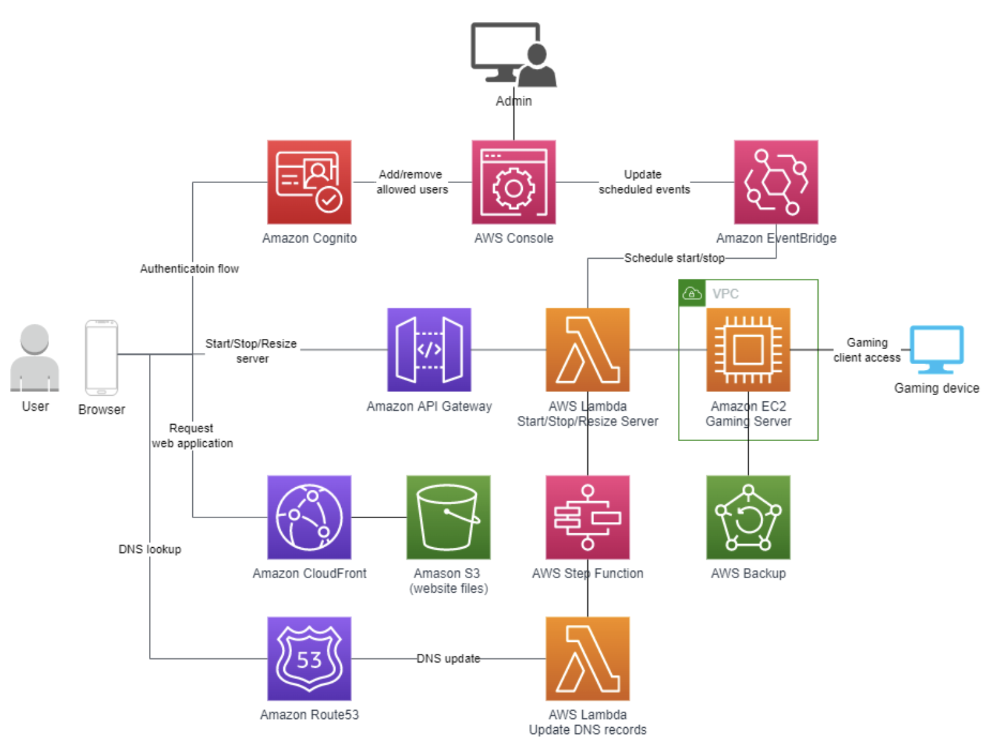

## Self Hosting gaming server
Self hosting gaming servers are fun for friends and I would like full controll of how much I spend as opposed to using other websites that charge a premium to do essentially this.

### Main ideas and architecture
Going to set up a s3 bucket website controller that will change start and stop the server being used. This website will be hosted with route 53. 
Ideally switching the game being hosted on the EC2 is ideal for this will have the EC2 use a docker image that configures the desired game that wants to be hosted and can be changed up like a game cartridge.

### Valheim specific set up
there are a few necessarry UDP and TCP ports that have to be open. This will be configured on the AMI with a bash script. Changing the game would require changes to that bash script.

Much of this is based off the work done here 
https://aws.amazon.com/blogs/gametech/hosting-your-own-dedicated-valheim-server-in-the-cloud/

